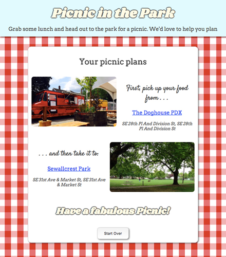

## Picnic in the Park

Picnic in the Park is a discovery tool to help plan a picnic.

## Summary

It finds parks at a given location, and then looks in that vicinity for food trucks or stands to outfit the picnic. The results are then summarized and presented to the user

It uses the Yelp API for the park and vendor data which is displayed through Google Maps.

The app is responsive in design.

## Screenshots

## Technology

This app uses HTML, CSS, JavaScript and JQuery, and is useable with any browser.